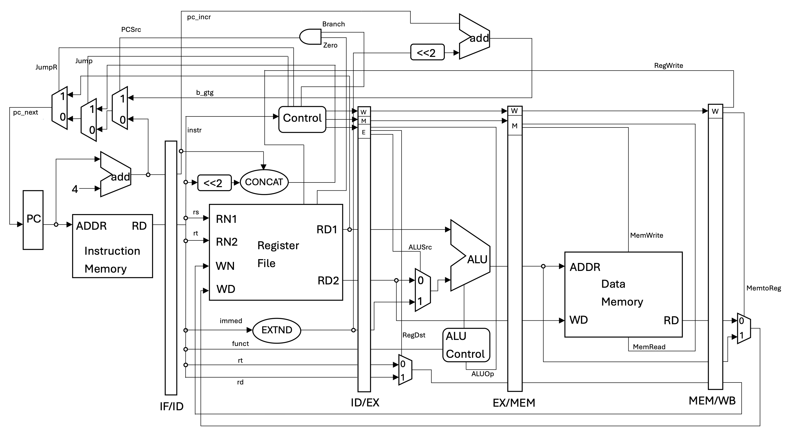

# pipelined-cpu-design
Verilog HDL project implementing a pipelined MIPS-Lite CPU using ModelSim

## 實現以下 16 道 MIPS 指令
a) Integer Arithmetic: `add`, `sub`, `and`, `or`, `sll`, `slt`, `andi`  
b) Integer Memory Access: `lw`, `sw`  
c) Integer Branch: `beq`, `j`, `jr`  
d) Integer Multiply/Divide: `multu`  
e) Other Instructions: `mfhi`, `mflo`, `nop`   

## 設計
- **ALU**：使用 [`alu-design/`](alu-design/) 中所設計之 ALU 完成 add, sub, and, or, sll, slt, andi 指令。詳情請見 alu-design 資料夾中的 [README.md](alu-design/README.md)。

- **Datapath**：所有指令之執行，須遵守 5-Stage Pipelined CPU 執行指令之行為。

- **multu**：32-bits 無號數乘法指令，使用 [`alu-design/`](alu-design/) 中所設計之 Multiplier。

- **Testbench (tb)**：為所設計之模組之測試平台，以讀檔的方式，讀入測試資料。以驗證所設計之模組，功能正確性。

## Datapath 架構圖

## Verilog 程式碼
程式在 [`src/`](src/) 資料夾中，部分所需程式 (ALU) 在 alu-design 資料夾中的 [`src/`](alu-design/src/) 資料夾中。

## 結果
詳細書面報告在 [report.pdf](report.pdf) 中。
