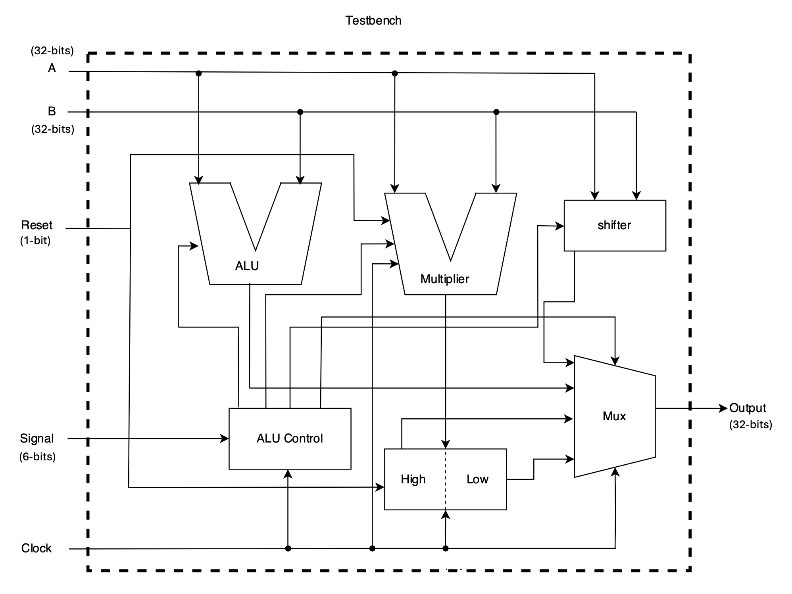

# alu-design
Verilog implementation of an Arithmetic Logic Unit (ALU) supporting seven operations: AND, OR, ADD, SUB, SLT, SLL, and MULTU.

## Datapath 架構圖


## 架構圖中的元件說明與設計
- **ALU**：包含 32-bits AND, OR, ADD, SUB, SLT 等功能，使用 Gate-Level Modeling 與 Data Flow Modeling (Continuous Assignments)，從 Full Adder 做起，以 Ripple-Carry 的進位方式，連接 32 個 1-bit ALU Bit Slice，成為 32-bits ALU。其中不直接使用 '+' operator，亦不使用 Always Block 或 Procedure Assignment 來設計。本模組為組合邏輯 (Combinational Logic)。
 
- **Multiplier**：為 32-bits 無號數乘法 (Sequential Multiplier)，採用 Second Version Sequential Multiplier 來設計。使用 Always Block 或 Procedure Assignment 來設計，不使用迴圈形式的設計，意即 Multiplier 內不能有 for/while 等敘述。本模組為循序邏輯 (Sequential Logic)，Clock 訊號同步。

- **Shifters**：32-bits Barrel Shifter，以完成邏輯左移運算。以 Data Flow Modeling (Continuous Assignments) 完成，其中不直接用 '>>' 或 '<<' operator，亦不使用 Always Block 或 Procedure Assignment 來設計。以 160 個 Mux 實現 Shifter。本模組為組合邏輯 (Combinational Logic)。

- **HiLo 暫存器**：為乘法器計算完後，儲存計算結果之 64-bits 暫存器。本模組為循序邏輯 (Sequential Logic)，Clock 訊號同步。

- **Mux (多工器)**：以 Data Flow Modeling 設計。本模組為組合邏輯 (Combinational Logic)。

- **ALU Control**：根據輸入的 6-bits 控制訊號，決定該完成哪一種運算。控制訊號與功能對應如下：
    ```
    Signal : 6-bits Value(Decimal)
    ---------------------
    AND : 36
    OR : 37
    ADD : 32
    SUB : 34
    SLT : 42
    SLL : 00
    MULTU : 25
    ---------------------
    ```
    本模組為循序邏輯 (Sequential Logic)，Clock 訊號同步。

- **Testbench (tb)**：為所設計之模組之測試平台，以讀檔的方式，讀入測試資料。以驗證所設計之模組功能正確性。

- **延遲 (delay)**：前述 7 項設計，除了 Testbench 項包含延遲 (#constant)，以作為 Clock 週期與 Reset 之用，其餘設計均無延遲 (#constant) 的敘述。

- **額外規定**：本 `alu-design` 內所有 Verilog 程式，除了 Testbench 外，其餘部分皆無迴圈形式的設計；意即程式內沒有 for/while 等敘述。亦無 Function/Task 敘述、無 always @(*) 敘述。  

## 結果
詳細書面報告在 [report.pdf](report.pdf) 中。
